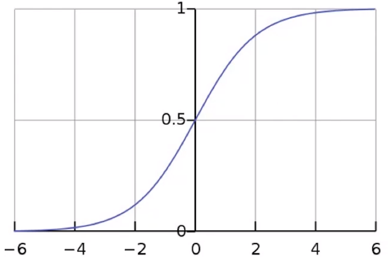

# 前言
**如果有不对的地方，大家可以留下宝贵的意见**

逻辑回归属于分类的算法，最常用的场景是二分类。

对于数据量非常大的时候，逻辑回归是首选的算法。

# 逻辑回归问题
为了解决分类问题，首先我们要定义一个条件概率$P(Y|X)$，那么它的表达式应该是什么样子呢？

那么能不能表示如下形式呢？

$P(Y|X) = w^Tx + b$

我们知道 $P(Y|X)$ 的取值范围是 $(0,1)$，而 $w^Tx + b$ 的取值范围是 $(-\infty, +\infty)$，所以这两者的值域不一样，也就不能这样表示了。

逻辑函数(sigmoid) $\sigma(x)$ 如下图所示：

逻辑函数有以下特点：

1. 经过(0, 0.5) 点
2. 当x=6时，$\sigma(6) \approx 1$；当x=-6时，$\sigma(-6) \approx 0$

所以，基于第2点，我们可以在底层做一些计算上的优化，减少计算量。

那么，有了逻辑函数之后，我们就可以将概率表达式写成如下形式：

$P(Y|X) = \sigma(w^Tx + b) = \frac{1} {1 + e^{-(w^Tx + b)}}$

**我们可以理解，逻辑回归是由两部分做成的，一部分是逻辑函数（logistic function），另一部分是线性回归（linear regression）。**

# 分类问题
对于二分类问题，我们可以写成如下形式：

$p(y=1|x; w,b) = \frac{1} {1 + e^{-(w^Tx + b)}}$

$p(y=0|x; w,b) = \frac{e^{-(w^Tx + b)}} {1 + e^{-(w^Tx + b)}} = 1 - p(y=1|x; w)$

以上两个式子可以合并入下形式：

$p(y|x; w,b) = p(y=1|x; w)^y[1 - p(y=1|x; w)]^{1-y}$

# 逻辑回归是否是线性分类器？
我们在判断一个模型是否是线性分类器时，不是看函数本身的形状，而是在于看决策边界是什么样子的。
这个方法同样也适用于判断其它的模型，比如SVM等。

我们知道，对于二分类问题，在决策边界上的任何一个点，它的概率都是相等的，都是0.5。所以，我们可以得出如下：

$p(y=1|x; w,b) = p(y=0|x; w)$

所以有：

$e^{-(w^Tx + b)} = 1$

两边取对数：

$w^Tx + b = 0$

上式就是逻辑回归决策边界的函数表达式，所以它是线性的。

# 逻辑回归的目标函数
假设我们有如下数据集：
$D = \left\{ (x_i, y_i) \right\}^n_{i=1}$，其中
$x_i \in R^d$，$y_i \in {0, 1}$

我们的目标就是让我们的概率值 $p(y|x; w,b)$ 最大化。

那么我们的目标就是找出 $\hat w$ 和 $\hat b$
使得样本中所有概率乘积 $\Pi^n_{i=1}p(y_i|x_i; w, b)$最大的值，即

$\hat w, \hat b = argmax_{w,b}\Pi^n_{i=1}p(y_i|x_i; w, b)$

以上也是一个MLE（Maximum Likelihood Estimate，极大似然估计）的过程。

**$\hat w, \hat b$的求解过程**

一般情况下，我们会把最大化问题转换成最小化问题，那么将上式转换成最小化问题只需要在前面加一个负号即可。

$\begin{eqnarray}
\hat w, \hat b
&=& argmax_{w,b}\Pi^n_{i=1}p(y_i|x_i; w, b)         \\\\
&=& argmin_{w,b}-\Pi^n_{i=1}p(y_i|x_i; w, b)        \\\\
&=& argmin_{w,b}-log\sum{^n_{i=1}}p(y_i|x_i; w, b)  \\\\
&=& argmin_{w,b}-log\sum{^n_{i=1}}p(y_i|x_i; w, b)  \\\\
&=& argmin_{w,b}-\sum{^n_{i=1}}log(p(y_i|x_i; w, b))  \\\\
\end{eqnarray}$

我们将 $p(y|x; w,b) = p(y=1|x; w)^y[1 - p(y=1|x; w)]^{1-y}$ 带入上式，有：

$\begin{eqnarray}
\hat w, \hat b
&=& argmin_{w,b}-\sum{^n_{i=1}}log(p(y_i|x_i; w, b))    \\\\
&=& argmin_{w,b}-\sum{^n_{i=1}}ylog(p(y_i=1|x_i; w, b)) + (1-y)log[1-p(y_i=1|x; w,b)]
\end{eqnarray}$

# 未完，待续。。。

方法一：

$$ f(x)=\left\{
\begin{aligned}
x & = & \cos(t) \\
y & = & \sin(t) \\
z & = & \frac xy
\end{aligned}
\right.
$$

方法二：
$$ F^{HLLC}=\left\{
\begin{array}{rcl}
F_L       &      & {0      <      S_L}\\
F^*_L     &      & {S_L \leq 0 < S_M}\\
F^*_R     &      & {S_M \leq 0 < S_R}\\
F_R       &      & {S_R \leq 0}
\end{array} \right. $$

方法三:
$$f(x)=
\begin{cases}
0& \text{x=0}\\
1& \text{x!=0}
\end{cases}$$

$\begin{eqnarray}
y&=& f(x) \\
&=& (x+2)^2 \\
&=&x^2 +4x +4
\end{eqnarray}$
